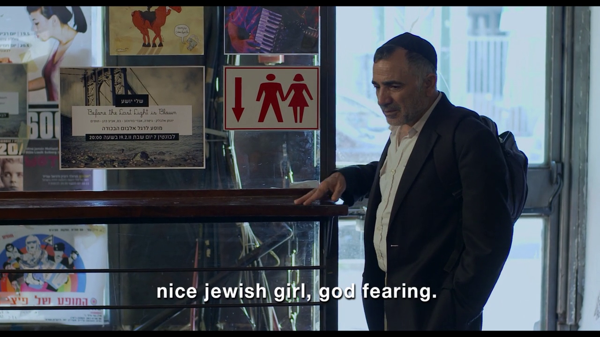

# Hybrid Video Dialogue Detector

A resource-efficient multimodal pipeline, multi-modal pipeline designed to find the exact frame and timestamp where a specific target dialogue appears in a video. It is built to seamlessly handle multiple sources of dialogue while minimizing bandwidth and processing time:
- **Embedded/External Subtitles** (`.srt`, `.vtt`)
- **Spoken Audio** (via GPU-accelerated `faster-whisper`)
- **Visual Scene Text** (via `EasyOCR`)

## How It Works (The Pipeline)

The pipeline prioritizes speed and efficiency by following a strict "Audio-First" fallback chain. We avoid downloading massive video files unless strictly necessary:

1. **Fast Subtitle Search:** We use `yt-dlp` to fetch *only* the subtitle files. The target dialogue is fuzzy-matched directly against the text. If found, we instantly get a candidate timestamp.
2. **Audio-First Fallback (Whisper):** If no subtitles exist or match, *only* the audio track is extracted and transcribed using `faster-whisper`.
3. **Targeted Segment Download & OCR Fusion:** Once a candidate timestamp is isolated (via subtitles or audio), the system downloads a short, targeted 20-second video segment (±10 seconds around the candidate) rather than the entire 10GB video. A visual OCR scan is run on this short segment to see if the text is physically on-screen.
4. **Full Video OCR (Last Resort):** If the dialogue is spoken but not physically written on-screen (or audio fails), the pipeline falls back to downloading the full video and running a coarse 1 FPS OCR scan.

## Mathematical Frame Calculation
If the text is not found visually on screen (i.e., it's a spoken dialogue), the pipeline falls back to a mathematical approach. It fetches the video's FPS and calculates the exact start frame using `int(timestamp_in_seconds * FPS)`, ensuring you always get an accurate `frame_number` in your output.

## Requirements

- Python 3.8+
- `ffmpeg` installed and available in your system's PATH.
- (Optional but highly recommended) NVIDIA GPU with CUDA support for Whisper and EasyOCR acceleration.
  > **Note for Users without a GPU:** If you don't have a local GPU, `faster-whisper` and `EasyOCR` can be quite slow on a CPU. We highly recommend running the pipeline on **Google Colab**, **Kaggle**, or another cloud provider where you can access a free GPU instance (like a T4) to run the script.

## Installation

1. Clone the repository:
   ```bash
   git clone https://github.com/narenkumarchandran/quest1.git
   cd quest1
   ```

2. Install the required Python dependencies:
   ```bash
   pip install -r requirements.txt
   ```

*(Note: Depending on your CUDA version, you may need to install a specific version of PyTorch manually for full GPU acceleration).*

## Testing

The project includes a comprehensive unit testing suite built with `pytest`. It covers fuzzy text matching, timestamp manipulation, and video metadata extraction (without needing to download heavy videos during the test).

To run the test suite, simply use the following command from the root directory:

```bash
python -m pytest tests/
```

## Usage

Run the pipeline from the project root by targeting `src/main.py`.

```bash
python src/main.py --url "<VIDEO_URL>" --target "<TARGET_DIALOGUE>" [OPTIONS]
```

### Examples

**Basic Run (CPU):**
```bash
python src/main.py --url "https://youtu.be/iXZ1jeTCU-o" --target "I'm the type of person"
```

**GPU Accelerated:**
```bash
python src/main.py --url "https://youtu.be/iXZ1jeTCU-o" --target "I'm the type of person" --gpu
```

### Options
- `--url`: The URL of the video (YouTube, OK.ru, Vimeo, etc. supported via `yt-dlp`).
- `--target`: The target dialogue phrase you want to locate.
- `--gpu`: Enable CUDA acceleration for `faster-whisper` and `EasyOCR` (significantly faster).
- `--threshold`: The fuzzy match confidence threshold (default: `75.0`).
- `--fast-mode`: Skip the final visual OCR refinement if the dialogue was matched via spoken audio.
- `--disable-subs`: Force the pipeline to ignore fast subtitle matching and test the Whisper/OCR fallback pathways.
- `--cookies`: Use browser cookies (Firefox) to bypass age restrictions or login walls when downloading with `yt-dlp`.
- `--output`: Custom output directory (default is `./output`).

## Output Format

All extracted files and results for a given video are stored in an isolated folder named after the video's ID inside the output directory (e.g., `output/<VIDEO_ID>/`). This folder contains:

1. **Subtitle File**: Downloaded `.srt` or `.vtt` file (if available).
2. **Audio File**: Extracted audio `.wav` (if Whisper was required).
3. **Short Video Clip**: A 20-second segmented `.mp4` clip around the target dialogue.
4. **Frame Screenshot**: A `.png` image of the exact frame where the text is found or spoken.
5. **Result JSON**: A structured JSON object containing the exact timestamp, frame number, and matching details.

Example JSON output:
```json
{
  "status": "success",
  "detection_type": "spoken_dialogue",
  "timestamp": "00:01:33.340",
  "frame_number": 2237,
  "dialogue_text": "you take the red pill",
  "similarity_score": 100.0,
  "frame_image_path": "C:\\Users\\name\\output\\zE7PKRjrid4\\frame_spoken_fallback.png",
  "tool_used": "subtitle",
  "video_dir": "C:\\Users\\name\\output\\zE7PKRjrid4"
}
```

Example Executions & Outputs:

### Example 1: Visual Match (OCR)
*(Finding the phrase "nice jewish girl, god fearing" in Vimeo ID 92760926)*

**Output Frame (`frame_216.png`):**


**Result JSON:**
```json
{
  "status": "success",
  "detection_type": "visual_text",
  "timestamp": "00:02:03.700",
  "frame_number": 200,
  "dialogue_text": "Can I say something ?",
  "similarity_score": 100.0,
  "frame_image_path": "C:\\Quest1\\output\\iXZ1jeTCU-o\\frame_200.png",
  "tool_used": "whisper, ocr",
  "video_dir": "C:\\Quest1\\output\\iXZ1jeTCU-o"
}
```

### Example 2: Spoken Match (Whisper)
*(Finding the phrase "My mind rebels at stagnation" in Video ID 248244667877)*

**Result JSON:**
```json
{
  "status": "success",
  "detection_type": "spoken_dialogue",
  "timestamp": "00:05:24.990",
  "frame_number": null,
  "dialogue_text": "My mind rebels at stagnation",
  "similarity_score": 85.0,
  "confidence": {
    "score": 15,
    "level": "LOW",
    "signals": {
      "subtitle_match": false,
      "ocr_strong": false,
      "ocr_moderate": false,
      "spoken_strong": true,
      "timestamp_agreement": false,
      "consecutive_frames": false
    }
  },
  "frame_image_path": "",
  "source": "whisper",
  "video_dir": "C:\\Quest1\\output\\248244667877"
}
```

## License

This project is licensed under the Apache License 2.0.
See the [LICENSE](LICENSE) file for details.