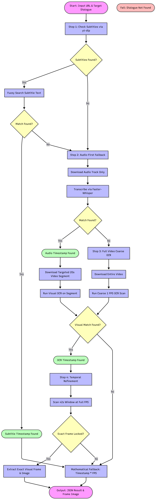

# Hybrid Video Dialogue Detection Pipeline - Approach & Flow

## 1. Overview
This system implements an efficient "Audio-First" phased architecture to identify the exact frame where a specific target dialogue appears in an online video. It minimizes bandwidth and computational cost by intelligently scaling its methods from lightweight text searches to heavy optical character recognition (OCR) based on a strict fallback chain.

### Demo Video

<video src="https://github.com/narenkumarchandran/quest1/raw/main/assets/Demo_video.mp4" controls="controls" style="max-width: 100%;">
  Your browser does not support the video tag.
</video>

## 2. Full Logic and Flowchart Diagram
The pipeline uses the following step-by-step logic, visualized in the flowchart below:



## 3. Detailed Explanation of the Approach

### Step 1: Subtitle Search (Fastest)
The pipeline first attempts to retrieve subtitles using `yt-dlp`. Subtitles are lightweight and can be downloaded almost instantaneously.
- If subtitles are found, `RapidFuzz` string matching is applied to search for the target dialogue. 
- If a match is successful, we immediately acquire a Candidate Timestamp, bypassing heavy audio and video processing entirely. The system trusts this timestamp and skips direct visual refinement unless explicitly configured otherwise.

### Step 2: Audio-First Fallback (Whisper)
If subtitles are unavailable or do not contain the target dialogue, the pipeline extracts and downloads only the audio track.
- The audio is transcribed locally using GPU-accelerated `faster-whisper`.
- We fuzzy-match the transcription to find the exact utterance. If successful, we establish an Audio Candidate Timestamp.

### Step 3: Targeted Segment Download & OCR Fusion
Once an Audio Candidate Timestamp is established, the pipeline avoids downloading the entire video.
- Instead, it requests a precise 20-second segment (±10 seconds around the candidate timestamp) using `yt-dlp` and `ffmpeg`.
- A Coarse OCR scan is run exclusively on this small segment to verify if the spoken words also appear visually as on-screen text.
- If the text is detected on-screen, the source type is upgraded to a "Fusion" match (Whisper + OCR). If not, it remains a spoken dialogue match.

### Step 4: Full Video Coarse OCR (Last Resort)
If the target is completely absent from the audio track (e.g., it is purely a visual sign or burned-in text without anyone speaking it), the pipeline resorts to downloading the full video.
- A Coarse OCR scan is performed at 1 FPS across the entire video.
- This is the most resource-intensive phase and is strictly reserved as a final fallback.

### Step 5: Temporal Refinement
For any candidate timestamp derived from Audio or OCR (where we have downloaded video segments), the pipeline performs fine-grained temporal refinement.
- It analyzes a small ±2.0 second window at full FPS around the candidate timestamp.
- The goal is to lock onto the exact, absolute first frame the target dialogue visually appears, or confirm the precise frame the utterance begins.

### Step 6: Mathematical Frame Calculation & Output
If the text is not visually written on-screen (pure spoken dialogue) or if the refinement was skipped (as in the Subtitle Search path):
- The pipeline utilizes a mathematical fallback. It retrieves the original video's frames-per-second (FPS) and computes the exact frame number using: `int(timestamp_in_seconds * FPS)`.
- Finally, all results, including the exact timestamp, derived frame number, match scores, and the specific tools used, are exported as a structured JSON object.

## 4. Matching Strategy
String matching is powered by `RapidFuzz`, blending `token_set_ratio` and `partial_ratio`. This fuzzy logic strategy is critical because:
- OCR often misinterprets characters (e.g., "I" vs "l").
- Whisper sometimes flips small words or omits punctuation.
- A rigid exact match would frequently fail, whereas fuzzy matching accommodates minor discrepancies.

## 5. Alternative Approaches Considered & Why They Were Not Implemented
During the design phase, we considered two primary alternatives that were ultimately rejected in favor of the current phased architecture:

1. **Brute Force Full-Video OCR (Visual-First Approach)**
   - **How it works**: Downloading the entire high-resolution video up front and running EasyOCR frame-by-frame (or at 1 FPS) across the full duration.
   - **Why it was rejected**: It is heavily bottlenecked by network bandwidth and compute limitations. Downloading a 10GB video takes significant time and storage. Furthermore, running deep-learning OCR on 10,000+ frames could take hours even on a GPU, whereas transcribing the audio track takes only seconds.
   
2. **Pure Speech-to-Text (No Visual Verification)**
   - **How it works**: Extracting the audio track, running Whisper to get a timestamp, and returning that timestamp directly without downloading any video.
   - **Why it was rejected**: This approach completely fails for non-spoken dialogue (e.g., visual signs, on-screen text, burned-in subtitles in a foreign language). It also fails to provide the exact visual frame where text appears (which can differ slightly from the audio start time). The current system's "Fusion" step solves this by verifying visually on a short 20s clip.

## 6. Tools Used & Why
- **yt-dlp (>=2024.1.1)**: Used to efficiently download metadata, subtitles, audio-only tracks, and specific targeted video segments without downloading the entire file. The pipeline includes a dynamic `--cookies` fallback strategy to optionally pass browser cookies for age-restricted/private videos, bypassing aggressive anti-bot JS challenges without breaking standard requests.
- **faster-whisper (>=1.0.0)**: An optimized implementation of OpenAI's Whisper model. Used for audio transcription due to its superior speed and accuracy compared to standard Whisper. Version 1.0.0+ is required for stable CTranslate2 integration and robust CUDA/GPU optimizations.
- **EasyOCR (>=1.7.1)**: A robust optical character recognition tool. Used to visually scan frames and detect burned-in scene text. This version provides stable support for PyTorch 2.x and updated text detection models.
- **opencv-python (>=4.9.0)**: Used for reading video streams and extracting individual frames. This version includes the latest stability improvements for `cv2.VideoCapture` and the ffmpeg backend.
- **Pillow (>=10.2.0)**: Used for image manipulation, primarily converting OpenCV frames to the format required by EasyOCR. This version patches critical security vulnerabilities and image processing bugs.
- **numpy (>=1.26.0)**: Used as the core dependency for matrix operations by OpenCV and EasyOCR. This version is necessary for compatibility with the latest OpenCV and PyTorch binary wheels.
- **RapidFuzz (>=3.6.1)**: An extremely fast string matching library. Used to reliably match target dialogue against generated text while tolerating small errors. Version 3.6.1+ offers substantial C++ string matching performance improvements.
- **rich (>=13.7.0)**: Used for rendering the formatted output, colored text, and progress in the terminal. Required for stable CLI formatting and broad terminal compatibility.
- **srt (>=3.5.3)**: Used to parse the VTT/SRT subtitle files downloaded via yt-dlp. Needed for reliable parsing of exact timestamped subtitle blocks.
- **ffmpeg**: A powerful multimedia framework. Used implicitly for handling precise sub-segment video downloads and extracting frames for OCR. Must be installed as a system tool.

## 7. Basic Instructions to Run

### Prerequisites
- Ensure you have **Python 3.8+** installed.
- Install **ffmpeg** and ensure it's available in your system's PATH.
- (Recommended) NVIDIA GPU with CUDA for faster processing.
  > **No local GPU?** Because `faster-whisper` and `EasyOCR` require significant compute, users without a dedicated GPU can easily run this pipeline on a cloud provider like **Google Colab** using a free GPU instance.

### Installation
1. Clone the repository and navigate into it:
   ```bash
   git clone <repo_url>
   cd quest1
   ```
2. Install the required dependencies:
   ```bash
   pip install -r requirements.txt
   ```

### Execution
Run the pipeline by targeting the main script and providing the video URL and the target dialogue:
```bash
# Basic run (CPU)
python src/main.py --url "https://youtu.be/iXZ1jeTCU-o" --target "I'm the type of person"

# GPU Accelerated Run
python src/main.py --url "https://youtu.be/iXZ1jeTCU-o" --target "I'm the type of person" --gpu

# Bypassing Age/Login Restrictions (Requires Firefox)
python src/main.py --url "https://youtu.be/iXZ1jeTCU-o" --target "I'm the type of person" --cookies
```
## Output Format

All extracted files and results for a given video are stored in an isolated folder named after the video's ID inside the output directory (e.g., `output/<VIDEO_ID>/`). This folder contains:

1. **Subtitle File**: Downloaded `.srt` or `.vtt` file (if available).
2. **Audio File**: Extracted audio `.wav` (if Whisper was required).
3. **Short Video Clip**: A 20-second segmented `.mp4` clip around the target dialogue.
4. **Frame Screenshot**: A `.png` image of the exact frame where the text is found or spoken.
5. **Result JSON**: A structured JSON object containing the exact timestamp, frame number, and matching details.

Example Executions & Outputs:

### Example 1: Visual Match (OCR)
*(Finding the phrase "nice jewish girl, god fearing" in Vimeo ID 92760926)*

**Output Frame (`frame_216.png`):**


**Result JSON:**
```json
{
  "status": "success",
  "detection_type": "visual_text",
  "timestamp": "00:02:03.700",
  "frame_number": 200,
  "dialogue_text": "Can I say something ?",
  "similarity_score": 100.0,
  "frame_image_path": "C:\\Quest1\\output\\iXZ1jeTCU-o\\frame_200.png",
  "tool_used": "whisper, ocr",
  "video_dir": "C:\\Quest1\\output\\iXZ1jeTCU-o"
}
```

### Example 2: Spoken Match (Whisper)
*(Finding the phrase "My mind rebels at stagnation" in Video ID 248244667877)*

**Result JSON:**
```json
{
  "status": "success",
  "detection_type": "spoken_dialogue",
  "timestamp": "00:05:24.990",
  "frame_number": null,
  "dialogue_text": "My mind rebels at stagnation",
  "similarity_score": 85.0,
  "confidence": {
    "score": 15,
    "level": "LOW",
    "signals": {
      "subtitle_match": false,
      "ocr_strong": false,
      "ocr_moderate": false,
      "spoken_strong": true,
      "timestamp_agreement": false,
      "consecutive_frames": false
    }
  },
  "frame_image_path": "",
  "source": "whisper",
  "video_dir": "C:\\Quest1\\output\\248244667877"
}
```

## 8. Future Enhancements
- **Multilingual Support**: Integrate automatic language detection to seamlessly handle non-English audio and subtitles.
- **Advanced Scene Text Recognition**: Incorporate more advanced deep learning models to read complex fonts, rotated text, and low-contrast subtitles better than standard OCR.
- **Parallel Processing**: Download and process audio and subtitles concurrently to further speed up the initial detection phase.
- **Batch & Playlist Processing**: Support scanning lists of videos or entire YouTube playlists automatically for batch processing.
- **Graphical User Interface (GUI)**: Add a user-friendly frontend (web or desktop) so non-technical users can interact with the pipeline easily.
- **Cloud/API Integration**: Deploy the architecture as an API or to serverless cloud functions for scalable, on-demand execution.
